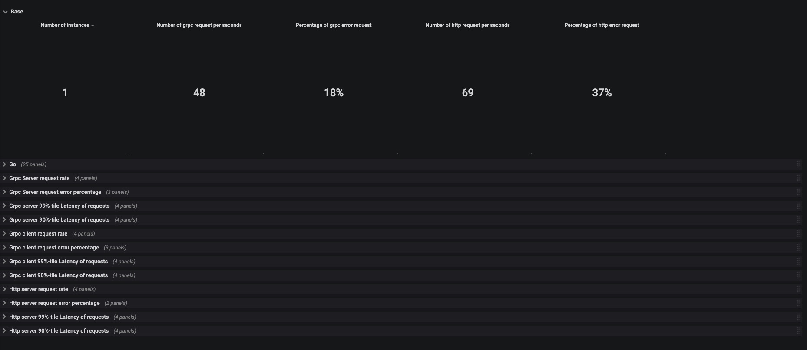
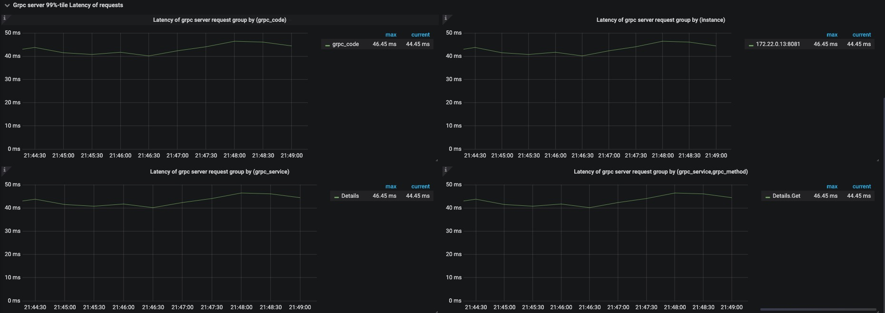
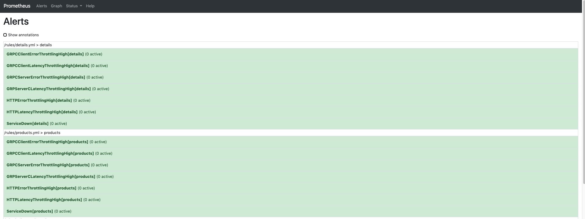
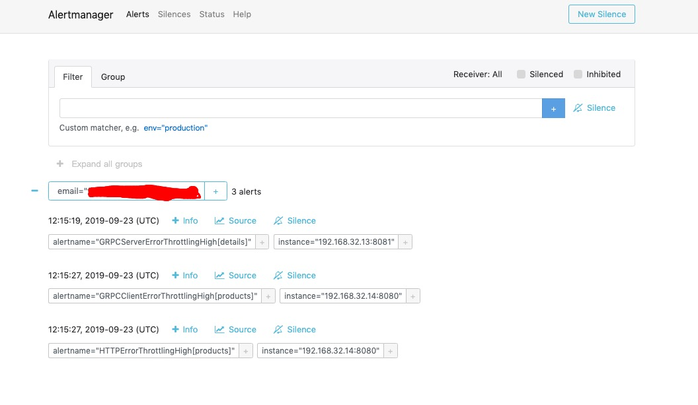
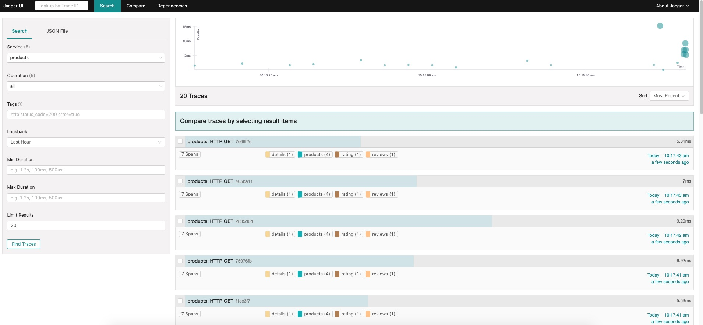
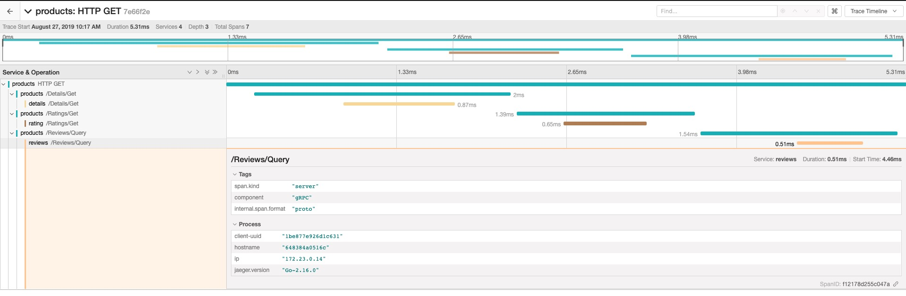

通过一个完整的项目的示例，从项目的结构、分层思想、依赖注入、错误处理、单元测试、服务治理、框架选择等方面介绍Go语言项目的最佳实践经验.
项目分为products、details、ratings、reviews四个微服务,依赖关系如下.


## 准备

安装docker,go,[jsonnet](https://jsonnet.org/)

## 快速开始
下载项目
```bash
    git clone https://github.com/sdgmf/go-project-sample.git
    cd go-project-sample
    git submodule init
    git submodule update
    make docker-compose
```

* **访问接口**： http://localhost:8080/product/1
* **consul**: http://localhost:8500/
* **grafana**: http://localhost:3000/ 
* **jaeger**: http://localhost:16686/search
* **Prometheus**: http://localhost:9090/graph
* **AlertManager**: http://localhost:9093


## 截图

Grafana Dashboard,可以自动生成!





Prometheus Alert 监控告警,自动生成！





调用链跟踪






## [中文文档](https://sdgmf.github.io/goproject/)
